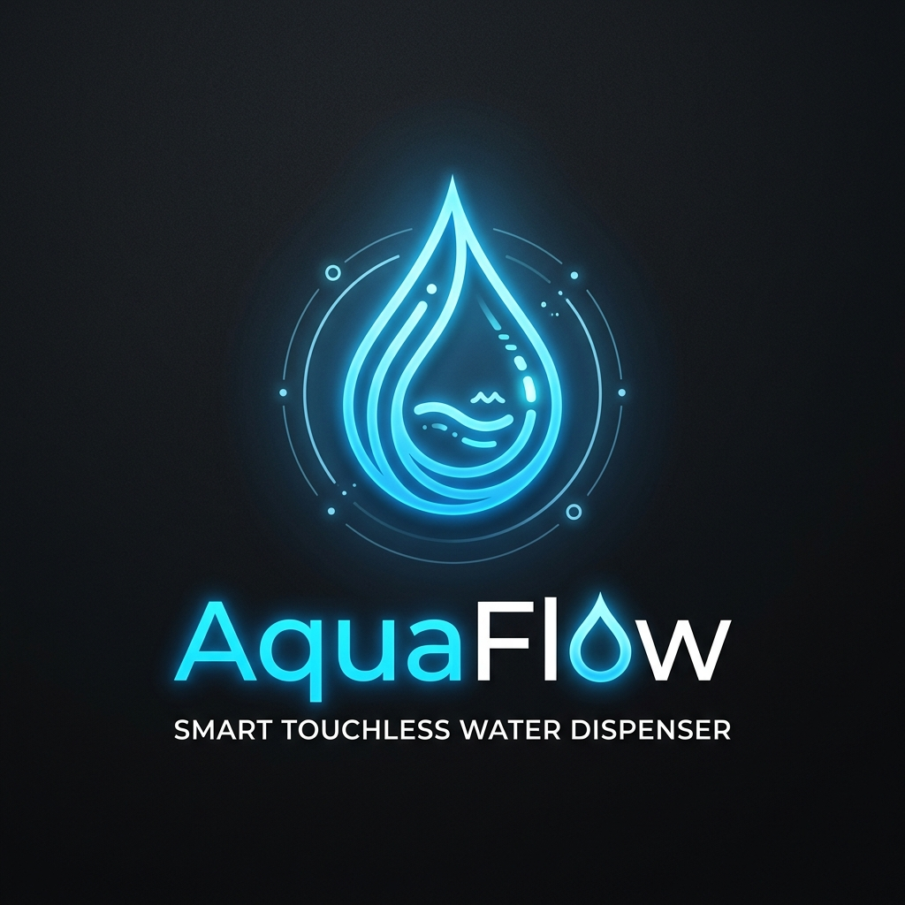
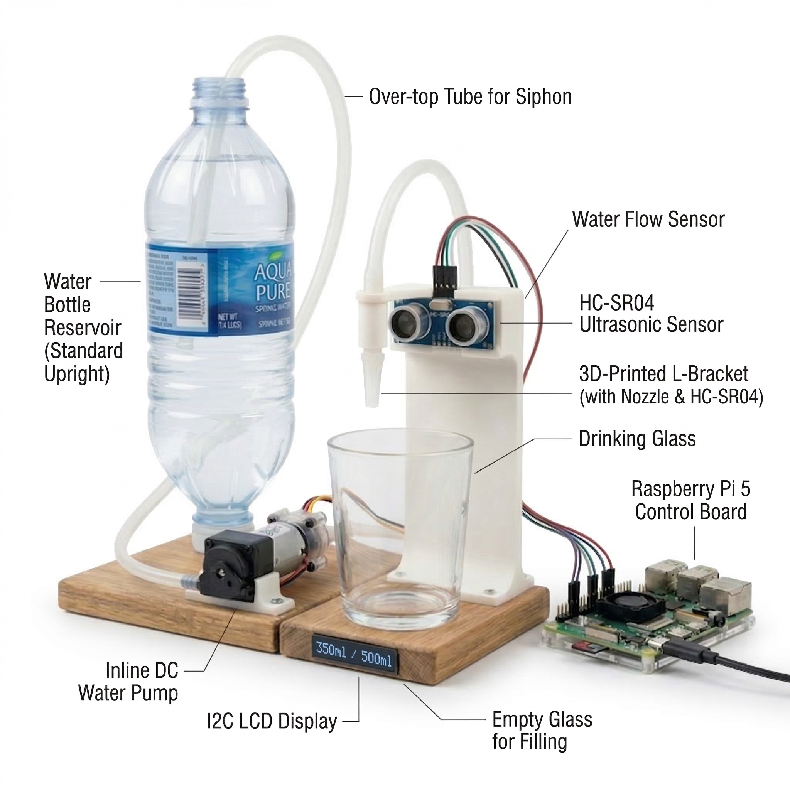
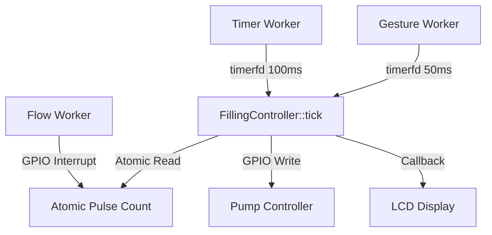

# AquaFlow Water Dispenser



AquaFlow is a smart, fully-automated touchless water dispenser built on the Raspberry Pi using C++. It utilizes intelligent hardware monitoring to safely dispense exact volumes of water using proximity detection.

### 🎥 [Watch the End-to-End Demo on YouTube](#) <!-- TODO: Add YT Link -->
### 📖 [Read our Project Tech Write-up on RS Design Spark](#) <!-- TODO: Add Blog Link -->

## 🛠️ Hardware Connections (Raspberry Pi Pinout)

Below is the definitive hardware wiring guide to connect the sensors and pump to the Raspberry Pi. For a visual representation, please refer to our physical circuit diagram:


> **Note:** Always ensure the Raspberry Pi is powered OFF when altering hardware connections. 

### 1. Gesture/Proximity Sensor (DollaTek APDS-9960)
This acts as the touchless cup detector. It communicates via the I2C protocol natively over `3.3V`.
| Sensor Pin | Raspberry Pi Pin | Function |
| :--- | :--- | :--- |
| **VCC** | **Pin 1 (3.3V)** | Main Power |
| **GND** | **Pin 6 (GND)** | Ground |
| **SDA** | **Pin 3 (GPIO 2)** | I2C Data Line |
| **SCL** | **Pin 5 (GPIO 3)** | I2C Clock Line |
| **VL** | **Pin 17 (3.3V)** | Powers the IR LED for proximity |

### 2. Water Flow Sensor (YF-S401)
Sends digital pulses to precisely measure volume.
| Sensor Wire Color | Raspberry Pi Pin | Function |
| :--- | :--- | :--- |
| **Red** | **Pin 2 (5V)** | Power |
| **Black** | **Pin 9 (GND)** | Ground |
| **Yellow** | **Pin 11 (GPIO 17)** | Pulse Signal Line |

### 3. DC Submersible Pump (JT80SL via TIP122 Transistor)
Driven via a Darlington TIP122 with a flyback diode.
- **Base**: GPIO 18 (via 1k resistor)
- **Collector**: Pump Negative (-)
- **Emitter**: Ground (GND)
- **Diode**: Across Pump (+) and Collector.

---

## 🏗️ System Architecture

The system follows a strict event-driven, non-blocking architecture using `timerfd` and `libgpiod` interrupts. For full class and sequence diagrams, see our detailed [Architecture Documentation](docs/architecture.md).



### ⏱️ Real-Time Timing Requirements
| Requirement | Value | Mechanism |
| :--- | :--- | :--- |
| Gesture Poll Interval | 50 ms | `timerfd` (blocking) |
| State Machine Tick | 100 ms | `timerfd` (blocking) |
| Flow Interrupt Latency | < 1 ms | `libgpiod` Edge Events |
| Emergency Stop | < 150 ms | Proximity CLEARED → Pump OFF |

---

## 👥 Division of Labor
| Team Member | Primary Responsibilities |
| :--- | :--- |
| **Abdullah Alkabbawi** | Real-Time Architecture, State Machine Logic, Hardware Integration, Multithreading. |
| **Mushyalpha** | Hardware Specifications, Documentation (ADRs), CAD Design, Integration Testing. |

---

## 💰 Bill of Materials (BoM)
| Item | Cost |
| :--- | :--- |
| DollaTek APDS-9960 Gesture Sensor | £4.99 |
| YF-S401 Water Flow Sensor | £7.45 |
| JT80SL DC Submersible Pump | £5.20 |
| TIP122 Transistor + Diode + Resistor Kit | £2.50 |
| 16x2 I2C LCD Display | £6.10 |
| Breadboard & Jumper Wires | £3.50 |
| Silicone Tubing (1m) | £2.00 |
| **TOTAL** | **£31.74 (Target: < £75)** |

---

## 🚀 Build & Run Instructions

### 1. Fresh Raspberry Pi Installation
If you are starting from a completely blank Raspberry Pi OS (Bookworm or newer), follow these steps:
1. **Flash OS:** Flash Raspberry Pi OS (64-bit recommended) onto a MicroSD card using Raspberry Pi Imager. Ensure SSH and Wi-Fi are configured.
2. **Boot & Connect:** Insert the SD card, boot the Pi, and SSH into it.
3. **Enable I2C:** Run `sudo raspi-config` -> `Interfacing Options` -> `I2C` -> Enable.
4. **Clone the Repo:** `git clone https://github.com/mushyalpha/AquaFlow.git && cd AquaFlow`

### 2. Prerequisites
Run the following exactly as listed to install C++ compilers, CMake, and the standard GPIO driver library:
```bash
sudo apt-get update
sudo apt-get install -y cmake g++ libgpiod-dev libgpiod-doc
```

### 3. Build Instructions
```bash
mkdir build && cd build
cmake ..
make -j$(nproc)
```

### 4. Running Tests
You can automatically run all unit tests from the `build` directory:
```bash
# Run Google Test unit tests
make test
# OR manually run ctest to view verbose outputs:
ctest -V

# (Optional) Run hardware integration testing binaries:
sudo ./hardware_trio_test
```

### 5. Running the Application
```bash
sudo ./filling_machine
```

---

## 📜 Licensing
This project is licensed under the MIT License - see the [LICENSE](LICENSE) file for details.
