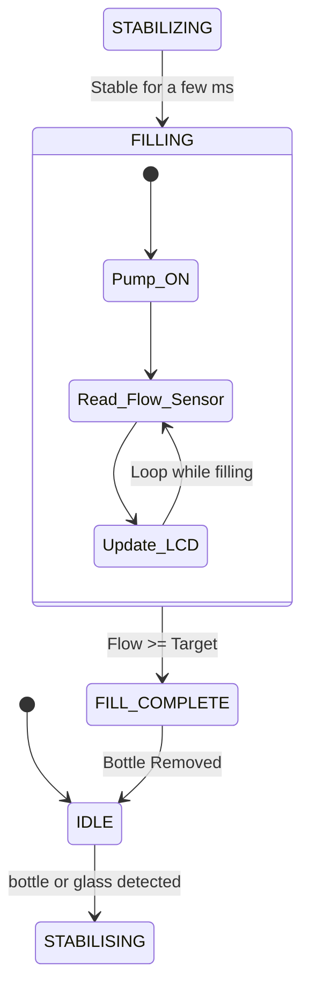

# Smart Flow - Automated Water Dispenser

**Components:** Water Pump | YF-S401 Flow Meter | HC-SR04 Ultrasonic Sensor

---

| Field                    | Details                                                        |
| ------------------------ | -------------------------------------------------------------- |
| **Project Title**  | Smart Flow - Automated Water Dispenser               |
| **Platform**       | Raspberry Pi 5 using C++                                          |
| **Core Mechanism** | Manual bottle placement → detect & stabilise → fill to target → remove |
| **Key Sensors**    | YF-S401 flow meter + HC-SR04 ultrasonic sensor                 |
| **Control Logic**  | Real time state machine (20ms loop)                            |

---

## 1. Summary

This project implements a real time Automated Water Dispenser on a Raspberry Pi 5 using C++. The system detects when a user places a bottle or a glass under the nozzle using an ultrasonic sensor, waits for the reading to stabilise (to ignore passing hands), fills the bottle to a precise target volume using a flow meter, and stops. The entire process is controlled by a hard real-time state machine running at a 20ms loop.

> **Hard real-time consequence of missing a deadline:** At a flow rate of ~400 ml/min, the pump dispenses ~6.6 ml/sec. If the pump-stop ISR is delayed by more than 5 ms, the bottle or glass overfills.

---

## 2. Problem Statement

Manual water bottling is slow and inconsistent in fill volume. This project demonstrates how an automated water dispenser can be built using an affordable single board computer and real-time C++, achieving high fill accuracy.

The core engineering challenges are:
1. Detecting a bottle or glass reliably with an ultrasonic sensor, filtering out spurious signals (like a hand moving past).
2. Monitoring the rising water surface with the same ultrasonic sensor to stop filling before the glass overflows.
3. Measuring dispensed volume accurately using pulse counting from a flow meter.
4. Ensuring the pump stops at exactly the right moment to hit the target volume.
5. Coordinating the sensors and pump as a single real-time system with no timing errors.

### The Complete Filling Cycle

| Step | Action |
| ---- | ------ |
| **Step 1: IDLE**      | System waiting, pump off. |
| **Step 2: DETECTED**  | Ultrasonic sensor detects object at correct distance. |
| **Step 3: STABILISE** | System waits briefly to confirm it is a bottle, not a hand. |
| **Step 4: FILLING**   | Pump on, flow meter counting pulses. |
| **Step 5: COMPLETE**  | Ultrasonic detects water surface near top, or pulse count hits target. Pump stops. |
| **Step 6: REMOVE**    | User removes filled bottle. System returns to Step 1. |

---

## 3. System Architecture

### 3.1 Physical Layout


### 3.2 State Machine Diagram



---

## 4. Software Architecture: Class Design (SOLID Principles)

All Raspberry Pi code is written in C++ following SOLID design principles. Each hardware component is contained in its own class with a well defined public interface. All internal data is private, and classes communicate exclusively through callbacks and setters, never through shared global state. Dynamic resources are managed via RAII and `std::shared_ptr`; there are no raw `new`/`delete` calls or void pointers in application code.

| Class                   | Responsibility |
| ----------------------- | -------------- |
| `WaterPump`           | Wraps relay GPIO; controls pump power via `on()`/`off()` setters |
| `FlowMeter`           | Owns pulse ISR thread; converts pulses to ml; exposes `std::function` callback on each pulse |
| `UltrasonicSensor`    | Manages trigger/echo pins; measures distance to bottle and rising water surface; exposes callback with distance reading |
| `FillingStateMachine` | Orchestrates state transitions; subscribes to sensor callbacks; calls pump setters |
| `MonitorThread`       | Normal-priority thread: LCD, MQTT, CSV log |

### 4.1 Event-Driven Callback Flow

The system is fully event-driven following the blocking I/O + thread wakeup pattern taught in the course. There are no polling loops or sleep based timing anywhere in the application.

---

---

**How each thread works:**

1. **FlowMeter thread** (priority 90): uses `libgpiod` `wait_edge_events()` as blocking I/O. The thread sleeps until a rising edge arrives from the YF-S401 Hall sensor, then increments the pulse counter and fires the callback. No CPU is consumed while waiting.
2. **UltrasonicSensor thread** (priority 80): triggers a 10us pulse on the trigger pin, then blocks on the echo pin edge event via `libgpiod`. The time between rising and falling edge gives distance. Fires callback with the result.
3. **FillingStateMachine** (priority 80): runs on a 20ms periodic loop using `clock_nanosleep`. Each iteration reads the latest sensor values delivered by callbacks and evaluates state transitions.
4. **MonitorThread** (normal priority): a non-real-time thread that updates the LCD, publishes MQTT telemetry, and writes CSV logs. It is never in the critical path.
5. **Main program**: after constructing all objects and registering callbacks via lambda functions, the main thread blocks (e.g. `getchar()`) and does no further work until shutdown.

---

## 5. Real-Time Latency Budget

All timing decisions are derived from measured or calculated worst-case latencies.

| Event                         | Latency Target | Consequence of Miss                | Mechanism |
| ----------------------------- | -------------- | ---------------------------------- | --------- |
| Flow meter pulse ISR response | < 1 ms         | Pulse lost, volume miscounted      | `SCHED_FIFO` 90 ISR thread (highest priority) |
| Pump stop at target volume    | < 2 ms         | Overfill by ~16 ml per ms of delay | ISR directly writes GPIO via `stop()` |
| LCD / MQTT update             | < 500 ms       | No user-visible impact             | Normal-priority `MonitorThread` (non-RT) |
| State machine loop period     | 20 ms          | Delayed response to sensor events  | `SCHED_FIFO`, `clock_nanosleep` periodic wake |

**Why `SCHED_FIFO` priority 80?** This places the control loop above standard Linux processes (priority 0 to 20) while reserving priority 99 for kernel interrupt threads and priority 90 for the pulse ISR, ensuring the flow meter ISR always pre-empts the state machine rather than the reverse.

---

## 6. GUI and Data Visualisation

A Qt 6 GUI runs on the Raspberry Pi and provides real-time plotting of the dispensing process. The GUI is refreshed via a Qt timer (screen refresh only, not used for real-time timing) while actual sensor data arrives through the callback architecture described above.

| Widget | Purpose |
| ------ | ------- |
| QCustomPlot graph | Live plot of flow rate (ml/s) and fill level over time |
| Volume label | Current dispensed volume in ml |
| Target spinbox | Allows the user to set a custom fill target via mouse/keyboard |
| Reset button | Clears the current fill and returns to IDLE |

The GUI thread is started last in `main()` with `app.exec()`, which blocks. All real-time threads are started before the GUI. Qt timers are used only for screen refresh (~40 ms interval) and are never used for sensor timing.

**Prerequisites for GUI:**

```
sudo apt-get install qt6-base-dev libqcustomplot-dev
```

---

## 7. Hardware Components

| Component                                      | Purpose |
| ---------------------------------------------- | ------- |
| Raspberry Pi 5                                 | Main real-time controller |
| SGerste JT80SL DC 3–6V Submersible Pump        | Draws water from bottle into cup (submerged, 80–120 L/h) |
| TIP121 NPN Transistor + 1 kΩ resistor          | Switches pump safely from GPIO 27 (3.3V GPIO → 5V pump) |
| 1N4007 Flyback Diode (across pump terminals)   | Suppresses back-EMF spike when pump turns off |
| YF-S401 Flow Meter                             | Measures fill volume in ml (Hall-effect pulse counting) |
| HC-SR04 Ultrasonic Sensor                      | Detects cup/bottle presence and distance |
| 16x2 LCD (I2C)                                 | Displays current dispensed volume and system state |

### Pump Wiring (GPIO 27 → TIP121 → DC Pump)

```
Raspberry Pi 5                    TIP121 Transistor
─────────────────                 ─────────────────
GPIO 27 ──[1 kΩ]──────────────► Base  (pin 1)
                                  Collector (pin 2) ──► Pump (–) terminal
                                  Emitter   (pin 3) ──► GND

5V rail (Pi header pin 2/4) ───────────────────────► Pump (+) terminal
                        [1N4007 diode across pump: cathode to (+), anode to (–)]
GND (Pi header pin 6) ─────────────────────────────► Common GND
```

> **⚠ Safety:** The pump is **not self-priming**. Submerge it in the water source before switching on, or it will run dry and overheat.

---

## 8. Build and Run

### Prerequisites

```bash
sudo apt-get install cmake g++ liblgpio-dev
```

### Step 1 – Pump smoke test (verify wiring first)

```bash
# From the SmartFlowX directory on the Raspberry Pi:
g++ -o /tmp/pump_test tests/pump_test.cpp -llgpio
sudo /tmp/pump_test
```

Expected: pump spins for 5 seconds, then stops. If nothing happens, check TIP121 wiring.

### Step 2 – Pump + flow sensor integration test

```bash
# With pump submerged and tube leading into cup:
g++ -o /tmp/pump_flow_test tests/pump_flow_integration_test.cpp -llgpio
sudo /tmp/pump_flow_test
```

Expected: pump runs for 10 s, pulse count and estimated volume printed each second.

### Step 3 – Full system

```bash
cmake -B build && cmake --build build
sudo ./build/SmartFlowX
```

`sudo` is required for GPIO access and `SCHED_FIFO` thread scheduling.

### Unit Tests

```bash
cmake --build build --target test
```

Unit tests verify:
- Flow meter pulse-to-ml conversion accuracy
- Ultrasonic sensor distance calculation
- State machine transitions (WAITING → CONFIRMATION → FILLING → FILL_COMPLETE)
- Pump GPIO on/off sequencing

---

## 9. Division of Labour

| Member            | Primary Responsibility |
| ----------------- | ---------------------- |
| Chandan and Radha | Hardware assembly: mechanical build, wiring, hardware sourcing |
| Bonolo and Abody  | Real time software: state machine, ISR handlers, SCHED_FIFO threading |
| Bonolo, Abody, Radha   | Sensor integration: flow meter calibration, ultrasonic sensor tuning |
| Mena              | Monitoring and data: LCD driver, MQTT dashboard, CSV logging |
| Mena and Radha    | Testing, documentation and presentation: unit tests, GitHub Pages |

---

## 10. License

This project is licensed under the MIT License.

