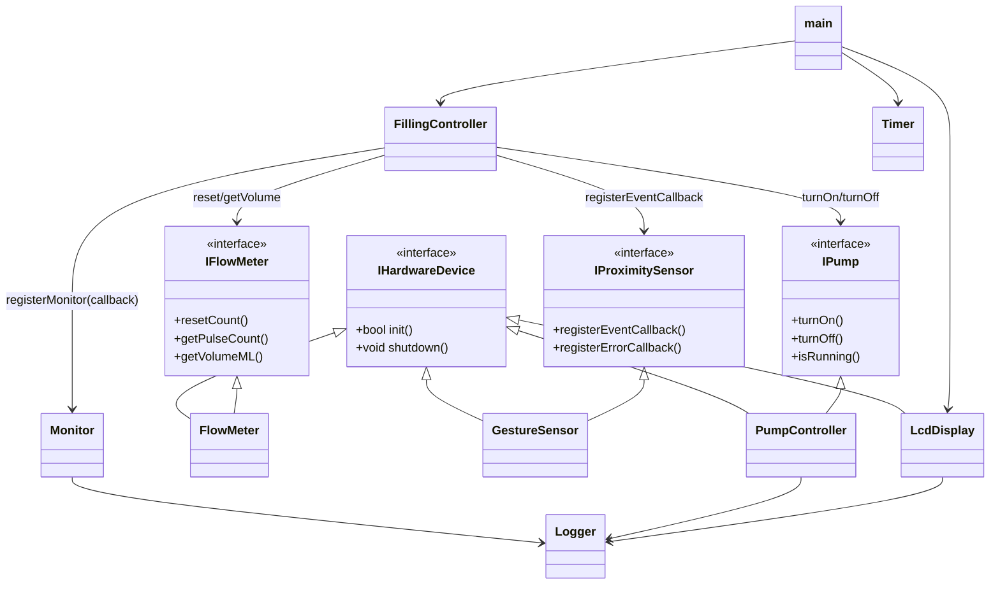

# AquaFlow Architecture

## OCP Inheritance and Dependencies

This diagram documents the inheritance hierarchy and the main composition links relevant to Open/Closed Principle review.

## OCP Notes

- Hardware drivers are extendable through `IHardwareDevice` without changing the base interface.
- `FillingController` depends on behavioral abstractions (`IProximitySensor`, `IPump`, `IFlowMeter`) rather than concrete hardware drivers.
- New hardware implementations can be added by extending interfaces and wiring them in composition code without modifying controller logic.
